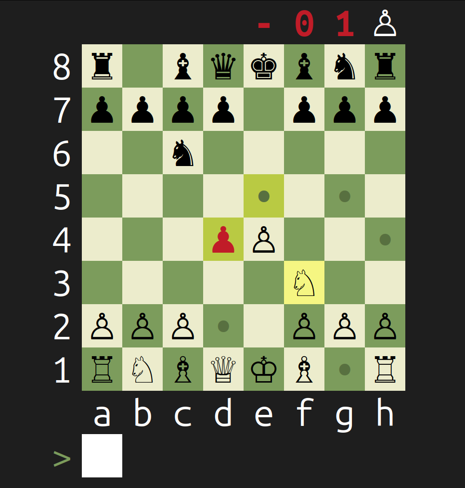

# ChessTUI

**Play chess in your terminal.**



> [!NOTE]
> This project is a terminal-based chess interface that integrates with the Stockfish engine for AI moves.

> [!WARNING]
> This project is developed and tested on **Ubuntu Linux** — compatibility with other platforms is not guaranteed.

> [!TIP]
> For the best experience, we recommend running the game on **GNOME Terminal**.

---

## Quick Start

### 1. Prerequisites ⚙️

Make sure you have:

* A C++17 compatible compiler (GCC 7+ or Clang 5+)
* GNU Make
* Stockfish binary (see below)

### 2. Stockfish Installation

Follow the instructions in the [Engine Setup Guide](src/engine/binary/README.md) to install the Stockfish binary in the correct location.

### 3. Building the Project

```bash
# Clone the repository
git clone https://github.com/a7mddra/ChessTUI.git
cd ChessTUI

# Build and run the game
make run
```

### 4. Game Controls 🎮
```
└── Use algebraic notation:
    ├── Moving pieces
    │   ├─ Highlight valid moves then move
    │   │   ├─ Highlight: type source (e.g. `e2`) then destination (e.g. `e4`)
    │   │   └─ Direct: type the full move at once (e.g. `e2e4`)
    │   └─ Direct move
    │       └─ Full move in one step (e.g. `e2e4`)
    │
    ├─ Pawn promotion
    │   ├─ Step by step: `e7` → `e8` → `q` or `e7` → `e8q`
    │   └─ Direct: `e7e8q`
    │
    ├─ King castling
    │   ├─ Kingside: `e1g1`
    │   └─ Queenside: `e1c1`
    │
    └─ Special commands
        ├─ Flip the board → `flip`
        ├─ Start a new game → `new`
        └─ Exit the app → `quit`
```
---

## Features ✨

* **Terminal-based UI** with Unicode symbols and ANSI color highlighting
* **Complete chess rules**:

  * Castling (kingside/queenside)
  * En passant captures
  * Pawn promotion
  * Check & checkmate detection
* **Stockfish AI integration**
* **Move validation** with visual highlights
* **Board flipping** (play as white or black)
* **Live evaluation bar** (material balance score)

---
